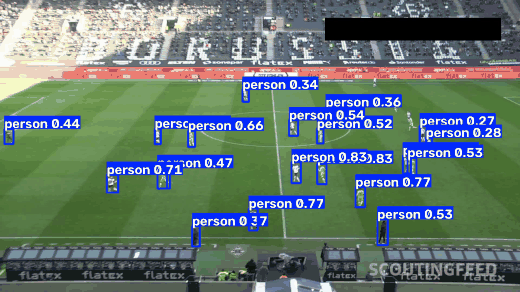
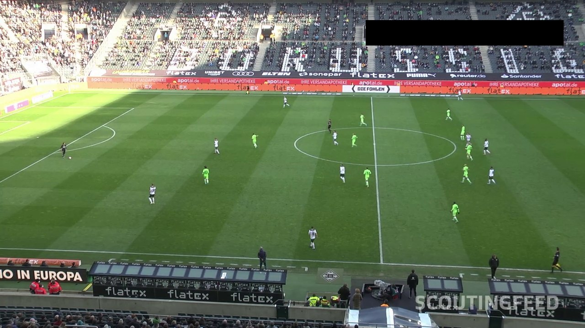
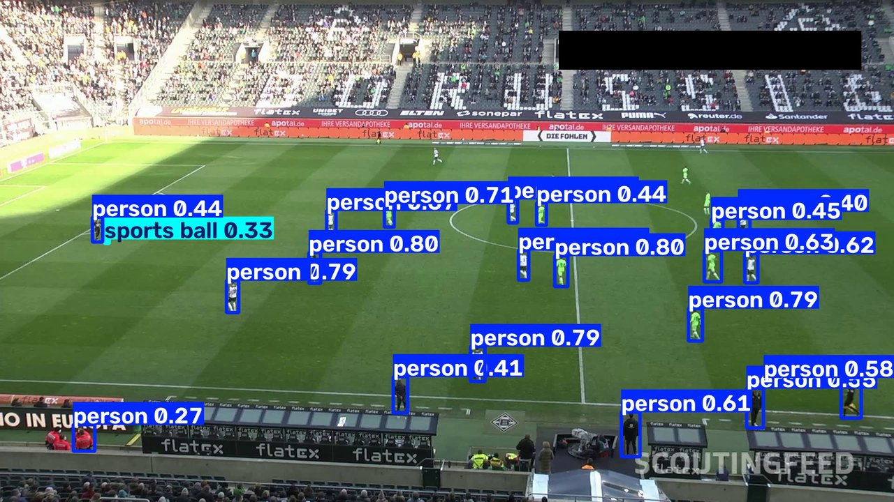

<div align="center">

# ⚽ Football Computer Vision Analysis

### Transformando um vídeo comum de futebol em dados de laboratório — ao vivo, do zero.

**Sem colete GPS. Sem sensor no atleta. Sem estádio equipado.**
Só o vídeo que o clube já grava.

<br>

[](https://www.youtube.com/live/scwTUaPM91M)
[](https://claude.ai/code/artifact/822d837a-e11b-4ff8-bb28-c06ee126f1c4)

<br>


</div>

---

## 🎯 O que é este projeto

Uma **série de lives** construindo, do zero e em público, um sistema de visão computacional que assiste a uma partida de futebol e devolve números:

<div align="center">

| O que entra | | O que sai |
|:---:|:---:|:---:|
| 🎥 **Um vídeo** | ➜ | 📏 **8.412 m** percorridos |
| Uma câmera aberta | ➜ | ⚡ **31,4 km/h** de pico |
| Nada no atleta | ➜ | 🗺️ Mapa de calor, posse, sprints |

</div>

O pipeline é **geral** — futebol é só o domínio. Troque o conjunto de exemplos e as mesmas etapas contam pessoas numa loja, carros numa avenida, peças numa esteira ou gado no pasto.

---

## 📺 As lives

> Cada live tem uma página própria com **o conteúdo destrinchado**, o código daquele dia e o que rodar para reproduzir.

<table>
<thead>
<tr>
<th width="60">#</th>
<th width="380">Tema</th>
<th>O que você sai sabendo</th>
<th width="130">Material</th>
</tr>
</thead>
<tbody>
<tr>
<td align="center"><b>01</b></td>
<td>
  <a href="docs/lives/live-01-como-a-maquina-enxerga.md"><b>👁️ Como a Máquina Enxerga</b></a><br>
  <sub>Aula zero · conceitos + primeira detecção</sub>
</td>
<td>
  Pixel, frame, FPS, dataset, treino × inferência, bounding box, confiança, NMS, tracking, fine-tuning, CPU × GPU — e a <b>primeira inferência YOLO rodando</b>.
</td>
<td>
  <a href="https://www.youtube.com/live/scwTUaPM91M">▶ Vídeo</a><br>
  <a href="https://claude.ai/code/artifact/822d837a-e11b-4ff8-bb28-c06ee126f1c4">📊 Slides</a><br>
  <a href="docs/lives/live-01-como-a-maquina-enxerga.md">📄 Notas</a>
</td>
</tr>
</tbody>
</table>

<div align="center">



<sub>▲ <b>O resultado da Live 01</b> — a primeira inferência rodando sobre <code>input_videos/cobaia.mp4</code></sub>

</div>

<table>
<tr>
<td width="50%" align="center"><b>Entrada</b> — <code>input_videos/cobaia.mp4</code></td>
<td width="50%" align="center"><b>Saída</b> — <code>runs/detect/predict/cobaia.avi</code></td>
</tr>
<tr>
<td></td>
<td></td>
</tr>
</table>

> [!NOTE]
> **Esse resultado ainda está errado de propósito** — e é justamente daí que sai o roteiro das próximas lives:
> todo mundo é `person` (falta ajuste fino), a bola aparece com `0.33` de confiança (falta calibrar o corte),
> há caixas duplicadas e ninguém tem um número fixo (falta rastreamento).
> A [página da Live 01](docs/lives/live-01-como-a-maquina-enxerga.md#-lendo-o-resultado-o-que-deu-errado-de-propósito) destrincha cada um desses erros.

---

## ⚡ Rodando em 4 comandos

<details open>
<summary><b>Pré-requisitos</b></summary>

- **Python 3.13** (fixado em [`.python-version`](.python-version))
- **[uv](https://docs.astral.sh/uv/)** — gerenciador de ambiente e dependências
- **GPU NVIDIA é opcional.** Sem placa dedicada tudo funciona igual — só é preciso paciência e vídeos mais curtos nos testes.

</details>

```bash
# 1. clone
git clone https://github.com/lucaspaludo/football_analysis_live.git
cd football_analysis_live

# 2. ambiente + dependências (uv resolve tudo pelo uv.lock)
uv sync

# 3. coloque um vídeo de partida em input_videos/cobaia.mp4
#    (30 s, 1920x1080, 25 fps é o formato usado nas lives)

# 4. primeira inferência — baixa o yolo26x.pt na primeira execução
uv run yolo_inference.py
```

O resultado sai anotado em **`runs/detect/predict/cobaia.avi`**.

---

## 🧰 Stack

| Ferramenta | Papel |
|---|---|
| **[uv](https://docs.astral.sh/uv/)** | Ambiente e dependências reprodutíveis via `uv.lock` |
| **[Ultralytics YOLO26](https://docs.ultralytics.com/)** | Detecção de objetos — jogadores, bola, juiz |
| **[PyTorch](https://pytorch.org/) (cu118)** | Motor de inferência, com aceleração CUDA |
| **[OpenCV](https://opencv.org/)** | Leitura, escrita e manipulação de frames |
| **[Supervision](https://supervision.roboflow.com/)** | Anotação, rastreamento e utilitários de CV |
| **[scikit-learn](https://scikit-learn.org/)** | Agrupamento de cores para separar os times |
| **[pandas](https://pandas.pydata.org/)** | Séries temporais das métricas por jogador |

---

<div align="center">

### 🤝 Acompanhe

As lives são abertas e o código nasce em tempo real, com erro, tentativa e refação incluídos.

[](https://www.youtube.com/live/scwTUaPM91M)

<sub>Feito por <b><a href="https://github.com/lucaspaludo">Lucas Paludo</a></b> · construído em público, uma live por vez.</sub>

</div>
