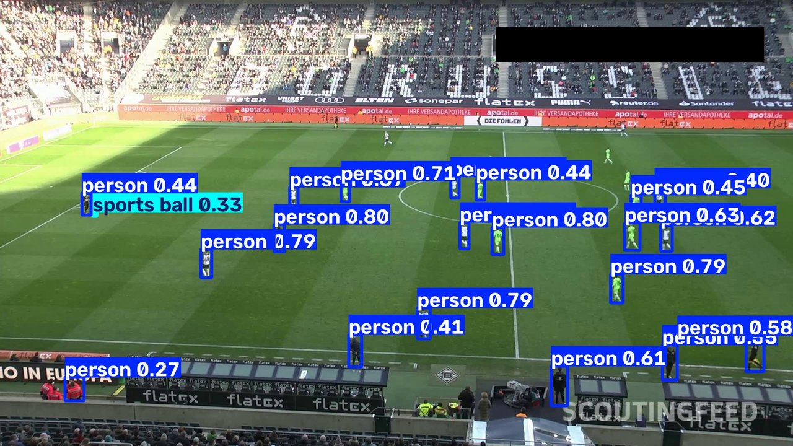
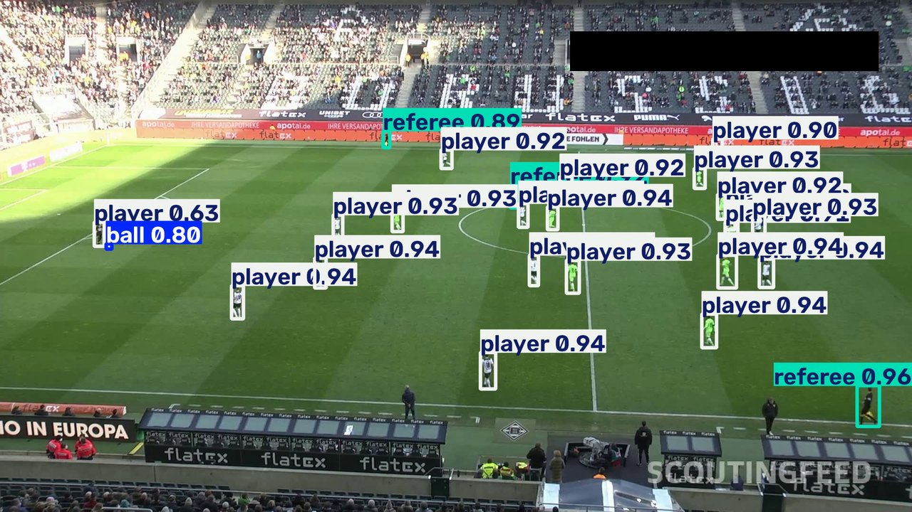

<div align="center">

<sub>[⬅ voltar para o índice do projeto](../../README.md)</sub>

# 🎓 Live 02 — Treinando o Modelo

### Do generalista ao especialista: uma GPU emprestada, 612 fotos e uma hora de treino.

[](https://www.youtube.com/live/L-HGpOOBtz8)
[](../../training/futebol_training_yolo26.ipynb)

<a href="https://www.youtube.com/live/L-HGpOOBtz8">
  
</a>

</div>

---

## 📋 Índice

- [Por que treinar](#-por-que-treinar)
- [O dataset](#-o-dataset)
- [O notebook, célula a célula](#-o-notebook-célula-a-célula)
- [O que o treino produziu](#-o-que-o-treino-produziu)
- [Antes e depois](#-antes-e-depois)
- [Glossário](#-glossário)

---

## 🎯 Por que treinar

A Live 01 terminou com um modelo que via **tudo como `person`** — jogador, juiz, técnico, gandula e torcedor na arquibancada, todos na mesma caixa azul. A bola mal passava do corte, com `0.33` de confiança.

O motivo é simples e foi dito lá: **um modelo nunca é melhor que os exemplos que recebeu.** O `yolo26x.pt` de prateleira foi treinado no COCO, um conjunto de fotos do mundo em geral. Ele nunca viu um juiz de futebol na vida — então não tem como reconhecer um.

<div align="center">

| Modelo de prateleira | Depois do ajuste fino |
|:---:|:---:|
| `person` `person` `person` `?` | `player` `goalkeeper` `referee` `ball` |
| confiança entre `0.27` e `0.80` | confiança entre `0.63` e `0.96` |
| detecta a torcida e a comissão técnica | ignora quem não está em jogo |

</div>

> 🔑 **Fine-tuning não é treinar do zero.** É pegar um modelo que já sabe enxergar — bordas, texturas, partes, corpos — e mostrar algumas centenas de fotos do *nosso* mundo para ele reaprender só a última parte: os nomes que importam aqui.

---

## 🧱 O dataset

Nada de desenhar 612 imagens à mão. O conjunto veio pronto do **Roboflow Universe**, público e já rotulado:

<div align="center">

| | |
|---|---|
| **Projeto** | [`roboflow-jvuqo/football-players-detection-3zvbc`](https://universe.roboflow.com/roboflow-jvuqo/football-players-detection-3zvbc) · versão 1 |
| **Formato** | `yolov8` — imagens + um `.txt` de rótulos por foto |
| **Treino** | **612 imagens**, 0 corrompidas |
| **Validação** | **38 imagens**, 905 instâncias anotadas |
| **Classes** | `ball` · `goalkeeper` · `player` · `referee` |

</div>

As quatro classes são exatamente o que faltava na Live 01. Repare que **`player` e `goalkeeper` são classes separadas** — o goleiro tem camisa de outra cor e função diferente, então vale distinguir desde o rótulo.

> ⚠️ **O desequilíbrio que vai cobrar o preço lá na frente:** na validação há **754 jogadores** anotados contra **35 bolas**. Guarde esse número — ele explica a única métrica ruim do treino.

---

## 📓 O notebook, célula a célula

O treino roda no **Google Colab**, com GPU emprestada. O notebook tem 9 células e cada uma resolve um problema específico.

<table><tr><td width="60" align="center"><h3>01</h3></td><td>

### Conferir o terreno antes de começar

```python
!pip install -q ultralytics roboflow
ultralytics.checks()
assert torch.cuda.is_available(), "Runtime sem GPU: Ambiente de execução > Alterar tipo"

GPU_NAME = torch.cuda.get_device_name(0)
VRAM_GB  = torch.cuda.get_device_properties(0).total_memory / 1e9
IS_A100  = "A100" in GPU_NAME
```

O `assert` é o herói silencioso aqui. Sem ele, você descobre que o Colab te deu uma sessão **sem GPU** só depois de quarenta minutos de treino arrastado na CPU.

**O que saiu:** `NVIDIA A100-SXM4-40GB | 42 GB | A100=True` — 12 CPUs, 83,5 GB de RAM.

</td></tr></table>

<table><tr><td width="60" align="center"><h3>02</h3></td><td>

### Montar o Drive — o seguro contra queda de sessão

```python
from google.colab import drive
drive.mount("/content/drive")

DRIVE = pathlib.Path("/content/drive/MyDrive/football_analysis/runs")
LOCAL = pathlib.Path("/content/runs")          # treino escreve aqui
```

O Colab **desconecta sozinho**. Se o treino escrever só no disco da sessão, uma queda na época 60 joga fora uma hora de GPU.

A estratégia: o treino escreve rápido no disco local (`LOCAL`) e um *callback* copia os checkpoints para o Drive (`DRIVE`) a cada salvamento. Escrever direto no Drive seria lento demais.

</td></tr></table>

<table><tr><td width="60" align="center"><h3>03</h3></td><td>

### O preset: escolher onde gastar o tempo

```python
PRESET = "qualidade_maxima"      # rapido | equilibrado | qualidade_maxima
IMGSZ  = {"rapido": 640, "equilibrado": 960, "qualidade_maxima": 1280}[PRESET]

BATCH    = 0.70                  # fração da VRAM (AutoBatch)
RUN_NAME = f"yolo26x_{PRESET}_{IMGSZ}"
```

`IMGSZ` é o tamanho para o qual toda imagem é redimensionada antes de entrar na rede. **É o parâmetro que mais importa aqui** — e o motivo é a bola.

A 640 px, uma bola de futebol num plano aberto vira um borrão de 3 ou 4 pixels. A 1280 px, ela ainda é pequena, mas existe. O custo é direto: dobrar o lado quadruplica a conta.

O `BATCH = 0.70` não é "70 imagens por lote" — é **70% da VRAM**. O Ultralytics mede a placa e escolhe o número de imagens sozinho (*AutoBatch*). O mesmo notebook roda numa A100 de 40 GB e numa T4 de 16 GB sem editar nada.

</td></tr></table>

<table><tr><td width="60" align="center"><h3>04</h3></td><td>

### Afinar a máquina para o hardware que apareceu

```python
torch.set_float32_matmul_precision("high")   # libera TF32 nos Tensor Cores
torch.backends.cudnn.allow_tf32 = True

WORKERS = min(8, os.cpu_count() or 4)
RAM_GB  = psutil.virtual_memory().available / 1e9
CACHE   = "ram" if RAM_GB > 20 else "disk"
```

Três ajustes, três gargalos diferentes:

| Ajuste | Gargalo que ataca |
|---|---|
| **TF32** | A conta em si. Troca um pouco de precisão numérica por muita velocidade nos Tensor Cores. |
| **`WORKERS`** | A leitura do disco. Processos paralelos carregam as próximas imagens enquanto a GPU calcula. |
| **`CACHE`** | O disco de novo. Com RAM sobrando, o dataset inteiro vai para a memória e nunca mais é lido do disco. |

**O que saiu:** `workers=8 | RAM livre=87 GB | cache=ram`.

> 💡 A GPU é a parte cara. Todo esse bloco existe para ela **nunca ficar esperando** o resto da máquina.

</td></tr></table>

<table><tr><td width="60" align="center"><h3>05</h3></td><td>

### Baixar o dataset

```python
from google.colab import userdata
from roboflow import Roboflow

rf      = Roboflow(api_key=userdata.get("ROBOFLOW_API_KEY"))
project = rf.workspace("roboflow-jvuqo").project("football-players-detection-3zvbc")
dataset = project.version(1).download("yolov8")
```

> 🔐 **A chave não está escrita no código.** `userdata.get()` lê o cofre de segredos do Colab (🔑 na barra lateral). O notebook pode ser compartilhado sem vazar credencial nenhuma.

Repare no `version(1)`: o dataset é **versionado**. Quem rodar este notebook daqui a um ano baixa exatamente as mesmas 612 imagens.

</td></tr></table>

<table><tr><td width="60" align="center"><h3>06</h3></td><td>

### Consertar os caminhos do `data.yaml`

```python
loc  = pathlib.Path(dataset.location)
DATA = loc / "data.yaml"
cfg  = yaml.safe_load(DATA.read_text())
cfg.update(path=str(loc), train="train/images", val="valid/images", test="test/images")
DATA.write_text(yaml.safe_dump(cfg, sort_keys=False))
```

O `data.yaml` é o mapa que diz ao YOLO onde estão as imagens e quais são as classes. O arquivo que vem do Roboflow traz caminhos relativos que **quebram no Colab**.

Célula chata, cinco linhas, e resolve o erro mais comum de quem treina pela primeira vez.

**O que saiu:** `['ball', 'goalkeeper', 'player', 'referee']`

</td></tr></table>

<table><tr><td width="60" align="center"><h3>07</h3></td><td>

### O treino — com retomada automática

```python
# sessão caiu? traz o checkpoint do Drive de volta
if not LAST.exists() and DRIVE_LAST.exists():
    shutil.copytree(DRIVE / RUN_NAME, RUN_DIR, dirs_exist_ok=True)

def sync_to_drive(trainer):
    shutil.copytree(trainer.save_dir, DRIVE / RUN_NAME, dirs_exist_ok=True)

if LAST.exists():                       # já existe treino? continua de onde parou
    model = YOLO(str(LAST))
    model.add_callback("on_model_save", sync_to_drive)
    model.train(resume=True)
else:                                   # primeira vez: começa do modelo de prateleira
    model = YOLO("yolo26x.pt")
    model.add_callback("on_model_save", sync_to_drive)
    model.train(
        data=str(DATA),
        epochs=100, imgsz=IMGSZ, batch=BATCH,
        cache=CACHE, workers=WORKERS, patience=30,
        compile="default", channels_last=True,
        save_period=10,
        project=str(LOCAL), name=RUN_NAME, exist_ok=True,
        plots=True,
    )
```

A célula é **idempotente**: rodar de novo depois de uma queda retoma da última época salva em vez de recomeçar do zero.

| Parâmetro | O que faz |
|---|---|
| `YOLO("yolo26x.pt")` | O ponto de partida. **Não treinamos do zero** — herdamos tudo que o modelo já sabia. |
| `epochs=100` | O teto de passadas pelo dataset. É um limite, não uma meta. |
| `patience=30` | *Early stopping*: 30 épocas sem melhora e o treino para sozinho. |
| `save_period=10` | Grava um checkpoint a cada 10 épocas. |
| `channels_last` | Reorganiza os tensores no formato que o Tensor Core prefere. |
| `on_model_save` | O gancho que dispara a cópia para o Drive a cada salvamento. |

</td></tr></table>

<table><tr><td width="60" align="center"><h3>08</h3></td><td>

### Validar: quanto o modelo realmente aprendeu

```python
BEST    = RUN_DIR / "weights" / "best.pt"
model   = YOLO(str(BEST))
metrics = model.val(data=str(DATA), imgsz=IMGSZ, split="val")

for i, c in enumerate(metrics.box.ap_class_index):
    print(f"{model.names[c]:<12} AP50={metrics.box.ap50[i]:.3f}  AP50-95={metrics.box.ap[i]:.3f}")
print(f"\nmAP50={metrics.box.map50:.3f}  mAP50-95={metrics.box.map:.3f}")
```

A validação roda sobre as **38 imagens que o modelo nunca viu durante o treino**. É o equivalente a fazer a prova com questões que não estavam na lista de exercícios.

> ⚠️ Carregamos `best.pt`, não `last.pt`. São arquivos diferentes: `best` é a melhor época, `last` é a última. **Quase nunca são a mesma.**

</td></tr></table>

<table><tr><td width="60" align="center"><h3>09</h3></td><td>

### Medir a velocidade real

```python
dummy = np.zeros((720, 1280, 3), dtype=np.uint8)

def bench(m, half=False, n=50):
    for _ in range(10):                                  # aquecimento
        m.predict(dummy, imgsz=IMGSZ, device=0, half=half, verbose=False)
    torch.cuda.synchronize(); t0 = time.perf_counter()
    for _ in range(n):
        m.predict(dummy, imgsz=IMGSZ, device=0, half=half, verbose=False)
    torch.cuda.synchronize()
    return (time.perf_counter() - t0) / n * 1000
```

Duas sutilezas que separam uma medição honesta de um número inventado:

- **As 10 chamadas de aquecimento.** A primeira inferência sempre carrega kernels CUDA e aloca memória. Cronometrar ela é medir a preparação, não o trabalho.
- **`torch.cuda.synchronize()`.** A GPU trabalha de forma assíncrona — sem sincronizar, o cronômetro para antes de a placa terminar e o resultado sai absurdamente rápido.

**O que saiu:** `fp32 22.2 ms (45.0 FPS) | fp16 22.2 ms (45.1 FPS)`

> 🤔 **O `fp16` não ganhou nada — e isso é informação.** O treino já roda com AMP ligado por padrão, então a precisão reduzida já estava em uso. Nem toda otimização da lista rende; medir é o que separa as que rendem.

</td></tr></table>

---

## 📊 O que o treino produziu

### O treino parou sozinho

```
EarlyStopping: Training stopped early as no improvement observed in last 30 epochs.
Best results observed at epoch 35, best model saved as best.pt.

65 epochs completed in 1.016 hours.
```

<div align="center">

| | |
|---|---|
| **Épocas pedidas** | 100 |
| **Épocas rodadas** | 65 |
| **Melhor época** | **35** |
| **Tempo total** | **1,016 hora** numa A100 |
| **VRAM em uso** | ~10,9 GB (de 40 disponíveis) |
| **Ritmo** | ~37 s por época · 204 lotes |

</div>

O modelo atingiu o melhor resultado na época 35 e passou as 30 seguintes sem melhorar — então o `patience=30` cortou o treino. **As outras 35 épocas pedidas nunca rodaram, e isso é o sistema funcionando**, não falhando: treinar além do ponto de melhora só gasta GPU e começa a decorar o dataset em vez de aprender.

### As métricas, classe por classe

<div align="center">

| Classe | AP50 | AP50-95 | Instâncias no val |
|---|:---:|:---:|:---:|
| 🟢 **player** | **0.994** | **0.840** | 754 |
| 🟢 **goalkeeper** | **0.982** | 0.806 | 27 |
| 🟢 **referee** | **0.977** | 0.723 | 89 |
| 🔴 **ball** | 0.689 | 0.352 | 35 |
| | | | |
| **Geral (mAP)** | **0.910** | **0.680** | 905 |

<sub>Precisão geral **0.962** · Revocação geral **0.885**</sub>

</div>

**Jogador, goleiro e juiz estão praticamente resolvidos.** Um AP50 de `0.994` significa que o modelo acha quase todo jogador, quase sempre, com a caixa no lugar certo.

**A bola continua sendo o problema** — e o número diz exatamente qual:

- `AP50 = 0.689` → em 3 de cada 10 casos ele erra ou não acha a bola
- `AP50-95 = 0.352` → mesmo quando acha, **a caixa fica mal ajustada**

A diferença brutal entre os dois números é a assinatura de um **objeto pequeno**. Numa bola de 15 pixels, errar 3 pixels na borda já derruba a sobreposição abaixo do limite exigido. Some a isso as **35 instâncias de bola** contra 754 de jogador: o modelo teve vinte vezes menos oportunidade de aprender a bola.

> 📌 Mesmo assim é um salto enorme: na Live 01 a bola aparecia com **`0.33`** de confiança. Agora aparece com **`0.80`**.

### A velocidade

```
Speed: 2.7 ms preprocess · 26.1 ms inference · 2.0 ms postprocess  (por imagem)
Benchmark: 22.2 ms → ~45 FPS numa A100
```

45 quadros por segundo a 1280 px. O vídeo da série tem 25 fps, então **dá para processar em tempo real** — numa A100. Numa RTX 3060 local, espere de 3 a 5 vezes mais lento.

---

## 🔬 Antes e depois

O mesmo frame, o mesmo vídeo, a mesma linha de código de inferência. A única coisa que mudou foi **o arquivo de pesos**.

<table>
<tr>
<td width="50%" align="center"><b>Live 01</b> — <code>yolo26x.pt</code> (prateleira)</td>
<td width="50%" align="center"><b>Live 02</b> — <code>models/best.pt</code> (especialista)</td>
</tr>
<tr>
<td></td>
<td></td>
</tr>
</table>

| | Live 01 | Live 02 |
|---|---|---|
| **Classes** | tudo é `person` | `player` · `goalkeeper` · `referee` · `ball` |
| **Confiança típica** | 0.27 – 0.80 | 0.63 – 0.96 |
| **A bola** | `sports ball 0.33` | `ball 0.80` |
| **Torcida e comissão** | detectadas como `person` | ignoradas |
| **Caixas duplicadas** | várias | praticamente nenhuma |

Repare no detalhe mais interessante: **o modelo parou de detectar quem está fora de campo.** Ninguém programou "ignore a arquibancada" — ele aprendeu isso sozinho, porque nas 612 fotos de treino só quem estava em jogo recebeu uma caixa.

> [!NOTE]
> **Ainda falta a peça mais importante.** Cada jogador agora tem um *nome* certo, mas continua sem um *número*. Entre um frame e o outro o modelo esquece tudo — é o problema levantado no slide "Detectar não é acompanhar" da Live 01. Sem identidade estável, dá para contar jogadores, nunca para dizer que **um deles** correu 8.412 metros.

---

## 📖 Glossário

| Termo | Em uma frase |
|---|---|
| **Fine-tuning** | Especializar um modelo pronto com exemplos do nosso domínio, em vez de treinar do zero. |
| **Época (epoch)** | Uma passada completa por todas as imagens de treino. |
| **Lote (batch)** | Quantas imagens entram na GPU de uma vez. |
| **AutoBatch** | Deixar o Ultralytics escolher o tamanho do lote a partir de uma fração da VRAM. |
| **`imgsz`** | O tamanho para o qual toda imagem é redimensionada antes de entrar na rede. |
| **Treino × validação** | O conjunto que o modelo estuda × o conjunto que ele nunca viu, usado para medir. |
| **Early stopping** | Parar o treino quando N épocas passam sem melhora. Evita gastar GPU e decorar o dataset. |
| **`patience`** | Quantas épocas sem melhora o treino tolera antes de parar. |
| **Checkpoint** | O estado do modelo salvo no meio do treino, para retomar depois de uma queda. |
| **`best.pt` × `last.pt`** | A melhor época × a última época. Quase nunca são a mesma. |
| **Precisão (P)** | Do que ele apontou, quanto estava certo. |
| **Revocação (R)** | Do que existia, quanto ele achou. |
| **IoU** | O quanto a caixa prevista se sobrepõe à caixa real, de 0 a 1. |
| **AP50** | Acerto considerando válida uma sobreposição de 50%. O critério generoso. |
| **AP50-95** | A média do acerto de 50% a 95% de sobreposição. O critério rigoroso — mede o ajuste da caixa. |
| **mAP** | A média do AP entre todas as classes. O número único do modelo. |
| **TF32 / AMP** | Formatos numéricos reduzidos que aceleram a conta na GPU trocando um pouco de precisão. |
| **`workers`** | Processos paralelos que carregam imagens enquanto a GPU calcula. |
| **Augmentation** | Variar as fotos de treino (espelhar, borrar, mudar cor) para o modelo não decorar. |

<div align="center">
<br>

[](https://www.youtube.com/live/L-HGpOOBtz8)
[](../../training/futebol_training_yolo26.ipynb)

<sub>[⬅ voltar para o índice do projeto](../../README.md)</sub>

</div>
