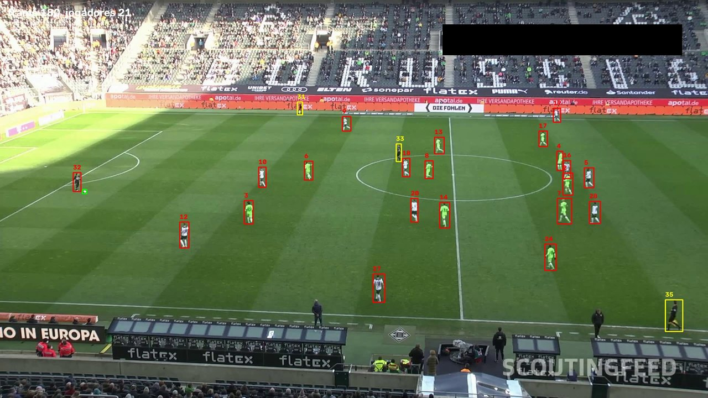
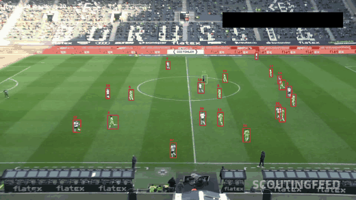

<div align="center">

<sub>[⬅ voltar para o índice do projeto](../../README.md)</sub>

# 🔗 Live 03 — Rastreamento com ByteTrack

### Detectar não é acompanhar. Dando um número fixo a cada jogador.



<sub>▲ O mesmo frame das Lives 01 e 02 — agora cada jogador carrega um <b>ID</b></sub>

</div>

---

## 📋 Índice

- [O problema que sobrou das lives anteriores](#-o-problema-que-sobrou-das-lives-anteriores)
- [Como o ByteTrack funciona](#-como-o-bytetrack-funciona)
- [O código, arquivo por arquivo](#-o-código-arquivo-por-arquivo)
- [O cache que salva horas](#-o-cache-que-salva-horas)
- [Lendo o resultado](#-lendo-o-resultado)
- [Glossário](#-glossário)

---

## 🎯 O problema que sobrou das lives anteriores

A Live 02 entregou um modelo que acerta `player`, `goalkeeper`, `referee` e `ball` com `mAP50 de 0.910`. Parecia resolvido — mas tinha um buraco levantado lá no slide 09 da Live 01:

> **O detector é amnésico.** Cada foto nasce do zero.

Isso significa que, com detecção pura, dá para dizer **"há 22 jogadores em campo"**, mas é impossível dizer **"este jogador correu 8.412 metros"** — porque não existe "este jogador". Existem 22 caixas no frame 1, outras 22 no frame 2, e nenhuma ligação entre elas.

<div align="center">

| Sem rastreamento | Com rastreamento |
|:---:|:---:|
| `player` `player` `player` | `#7` `#12` `#3` |
| dá para **contar** | dá para **medir** |
| 22 caixas soltas por frame | 22 trajetórias ao longo do jogo |

</div>

Tudo que a série promete — distância percorrida, velocidade de pico, mapa de calor individual, posse por jogador — depende desta live. **Sem identidade, não existe métrica individual.**

---

## 🧠 Como o ByteTrack funciona

O **ByteTrack** liga caixas de um frame às caixas do frame seguinte. A ideia central dele é simples e, quando você entende, parece óbvia.

### O que os rastreadores faziam antes

Rastreadores tradicionais jogam fora toda detecção de baixa confiança antes de associar. Faz sentido à primeira vista: caixa com `0.3` de confiança costuma ser lixo.

O problema é que **um jogador parcialmente ocluso gera exatamente uma caixa de baixa confiança**. Jogar ela fora é perder o rastro justo no momento mais difícil — quando dois atletas se cruzam, que é o tempo todo num jogo de futebol.

### A sacada do ByteTrack

Usar **todas** as caixas, em duas rodadas:

```
rodada 1    confiança ≥ 0.25          →  associa aos rastros existentes
rodada 2    confiança entre 0.1 e 0.25 →  tenta casar com os rastros que sobraram
            o que não casou em nenhuma das duas  →  vira rastro novo
```

A segunda rodada é o truque. Um rastro que ficou órfão na rodada 1 provavelmente pertence a um jogador ocluso — e a caixa fraca que ninguém quis é justamente a dele.

> 💡 **Por isso o `conf=0.1` no código.** Não é número mágico: na implementação do `supervision`, a faixa baixa é exatamente `confiança > 0.1`. Pedir ao YOLO um corte maior mataria a rodada 2 antes dela existir; pedir menos seria desperdício, porque o ByteTrack descarta de qualquer jeito. **O ByteTrack *quer* as caixas ruins.**

### Como ele decide o que casa com o quê

Duas peças:

| Peça | O que faz |
|---|---|
| **Filtro de Kalman** | Prevê onde cada jogador deveria estar no próximo frame, a partir da velocidade atual. É o que permite acompanhar movimento em vez de só comparar posições. |
| **IoU** | Mede a sobreposição entre a caixa prevista e as caixas detectadas. Quanto maior, mais provável que sejam a mesma pessoa. |

A associação resolve o emparelhamento global — não é "cada rastro pega a caixa mais próxima", e sim a combinação que melhor satisfaz todos ao mesmo tempo.

> ⚠️ **Repare no que o ByteTrack *não* usa: aparência.** Ele não olha a cor da camisa nem o rosto. É só geometria e movimento. Isso o deixa rápido e é a raiz da limitação que aparece no fim desta página.

---

## 💻 O código, arquivo por arquivo

A live reorganizou o projeto em módulos. Saiu do script solto e virou estrutura.

```
football_analysis_live/
├── main.py                  # orquestra: lê, rastreia, desenha, salva
├── trackers/
│   ├── __init__.py
│   └── tracker.py           # 🎯 a classe Tracker
└── utils/
    ├── __init__.py
    └── video_utils.py       # ler, salvar e exibir vídeo
```

<table><tr><td width="60" align="center"><h3>01</h3></td><td>

### `utils/video_utils.py` — entrada e saída

```python
def read_video(video_path, max_frames=None):
    cap = cv2.VideoCapture(video_path)
    frames = []
    while True:
        ret, frame = cap.read()
        if not ret:
            break
        frames.append(frame)
        if max_frames is not None and len(frames) >= max_frames:
            break
    cap.release()
    return frames
```

O `max_frames` é pequeno e salva o dia: durante o desenvolvimento você testa com 50 frames em vez de 750, e o ciclo de tentativa cai de minutos para segundos.

O `save_video` grava e, com `show=True`, **exibe enquanto grava**, respeitando o fps real do vídeo. Espaço pausa, `q` ou Esc fecha.

> ⚠️ **Cuidado com `read_video` em vídeo longo.** Ele carrega *todos* os frames numa lista. Para 30 segundos são 750 frames de 1920×1080 — cerca de 4,5 GB de RAM. Para um jogo de 90 minutos seriam 129.600 frames: não cabe em nenhuma máquina. O caminho é processar em streaming, frame a frame.

</td></tr></table>

<table><tr><td width="60" align="center"><h3>02</h3></td><td>

### `trackers/tracker.py` — detecção em lote

```python
class Tracker:
    def __init__(self, model_path):
        self.model = YOLO(model_path)
        self.tracker = sv.ByteTrack()

    def detect_frames(self, frames):
        batch_size = 20
        detections = []
        for i in range(0, len(frames), batch_size):
            detections_batch = self.model.predict(frames[i:i+batch_size], conf=0.1)
            detections += detections_batch
        return detections
```

**Por que em lote de 20:** a GPU é eficiente processando várias imagens de uma vez. Mandar uma por uma desperdiça paralelismo; mandar as 750 de uma vez estoura a memória. Vinte é um meio-termo confortável.

**Por que `conf=0.1`:** é o combustível da segunda rodada do ByteTrack, explicada acima.

</td></tr></table>

<table><tr><td width="60" align="center"><h3>03</h3></td><td>

### O goleiro vira jogador — de propósito

```python
for object_ind, class_id in enumerate(detection_supervision.class_id):
    if cls_names[class_id] == "goalkeeper":
        detection_supervision.class_id[object_ind] = cls_names_inv["player"]
```

Parece que está jogando informação fora, mas está **protegendo a identidade**.

O goleiro é a classe com menos exemplos no dataset — 27 instâncias na validação, contra 754 de jogador. O modelo às vezes o chama de `goalkeeper`, às vezes de `player`, e troca de ideia entre um frame e outro.

> 🔍 **Vale saber onde o problema realmente está**, porque é contraintuitivo. O ByteTrack do `supervision` é **agnóstico a classe**: por dentro, ele monta os tensores só com as coordenadas e a confiança, e nunca vê o `class_id`. Ou seja, **o rastro do goleiro não quebraria** com a oscilação.
>
> Quem quebra é o código logo abaixo, que separa os resultados em baldes:
>
> ```python
> if cls_id == cls_names_inv["player"]:   tracks["players"][frame_num][track_id] = ...
> if cls_id == cls_names_inv["referee"]:  tracks["referees"][frame_num][track_id] = ...
> ```
>
> Nos frames em que o modelo diz `goalkeeper`, a detecção **não cai em nenhum dos dois baldes** — o goleiro simplesmente some do dicionário naquele frame, mesmo com o ByteTrack ainda acompanhando. A remarcação garante que ele caia sempre em `players`.

A distinção entre goleiro e jogador pode voltar depois, pela posição em campo.

</td></tr></table>

<table><tr><td width="60" align="center"><h3>04</h3></td><td>

### A bola não é rastreada

```python
# rastreando objetos
detection_with_tracks = self.tracker.update_with_detections(detection_supervision)
...
for frame_detection in detection_supervision:   # <- detecção crua, sem rastro
    cls_id = frame_detection[3]
    if cls_id == cls_names_inv["ball"]:
        tracks["ball"][frame_num][1] = {"bbox": bbox}
```

Repare: jogadores e juízes saem de `detection_with_tracks`; a bola sai de `detection_supervision`, a detecção **sem** rastreamento, e recebe sempre o ID fixo `1`.

**Por que:** só existe uma bola, então não há o que desambiguar. E o ByteTrack atrapalharia — ele assume movimento suave, e a bola muda de direção a 100 km/h num chute. O filtro de Kalman previria a posição errada e perderia o rastro.

> O preço: nos frames em que o modelo não acha a bola, não há bola. A interpolação da trajetória fica para uma próxima live.

</td></tr></table>

<table><tr><td width="60" align="center"><h3>05</h3></td><td>

### A estrutura de saída

```python
tracks = {
    "players":  [ {7: {"bbox": [...]}, 12: {...}},  {7: {...}, 12: {...}}, ... ],
    "referees": [ {33: {"bbox": [...]}},            {33: {...}},           ... ],
    "ball":     [ {1: {"bbox": [...]}},             {},                    ... ],
}
```

**Uma lista por tipo, um dicionário por frame, a chave é o ID.** Essa forma é escolhida pensando no que vem depois: para calcular a distância do jogador 7, basta percorrer os frames pegando `tracks["players"][frame][7]`.

Repare que o dicionário da bola está vazio em alguns frames — é a ausência mencionada acima, explícita na estrutura.

</td></tr></table>

<table><tr><td width="60" align="center"><h3>06</h3></td><td>

### O desenho

```python
def draw_tracks(self, video_frames, tracks):
    for frame_num, frame in enumerate(video_frames):
        frame = frame.copy()
        for track_id, player in tracks["players"][frame_num].items():
            self.draw_box(frame, player["bbox"], (0, 0, 255), str(track_id))
        ...
        hud = f"frame {frame_num} jogadores {len(tracks['players'][frame_num])}"
```

Cores em **BGR**, não RGB — a pegadinha do OpenCV que apareceu na Live 01. `(0, 0, 255)` é vermelho, não azul.

| Cor | Quem |
|---|---|
| 🔴 vermelho | jogadores (e goleiros) |
| 🟡 amarelo | juízes |
| 🟢 verde | bola |

O `frame.copy()` evita escrever por cima do frame original — sem ele, o vídeo de entrada ficaria rabiscado na memória.

</td></tr></table>

---

## 💾 O cache que salva horas

A melhor ideia de engenharia da live inteira:

```python
def get_object_tracks(self, frames, read_from_stub=False, stub_path=None):
    if read_from_stub and stub_path is not None and os.path.exists(stub_path):
        with open(stub_path, 'rb') as f:
            return pickle.load(f)
    ...
    if stub_path is not None:
        with open(stub_path, 'wb') as f:
            pickle.dump(tracks, f)
```

**O problema que ele resolve:** detectar e rastrear 750 frames leva minutos. Ajustar a cor de uma caixa leva um segundo. Sem cache, cada ajuste visual custaria o pipeline inteiro de novo.

Com o *stub*, a primeira execução grava o resultado em `stubs/track_stubs_cobaia.pkl`. As seguintes carregam de disco em um piscar.

> 📌 **Esse padrão vale para qualquer pipeline de visão computacional.** Separe a etapa cara e determinística da etapa barata e iterativa, e guarde o meio-do-caminho em disco. Vai usar isso a vida inteira.

Lembre de apagar o stub quando trocar o modelo ou o vídeo — senão você fica olhando o resultado antigo e se perguntando por que a mudança não surtiu efeito.

---

## 🔬 Lendo o resultado

```bash
uv run main.py
```

Saída em **`output_videos/tracking_cobaia.mp4`**.

<div align="center">
  
</div>

### Os números reais

Rodando o rastreador sobre os 750 frames e contando a vida de cada identificador:

<div align="center">

| | Medido |
|---|---:|
| Jogadores detectados por frame | 18 a 22 · média **20,6** |
| Juízes por frame | 1 a 4 · média 2,8 |
| Frames com a bola detectada | **92,7%** |
| **IDs de jogador emitidos** | **29** |
| IDs que sobrevivem a ≥ 90% do clipe | **18** |
| IDs que sobrevivem a ≥ 50% do clipe | 20 |
| Duração mediana de um ID | **744** de 750 frames |
| IDs efêmeros (≤ 5 frames) | 2 |

</div>

### O que funcionou — e funcionou bem

**Os IDs grudam.** Oito identificadores duram os **750 frames inteiros**, e a mediana de vida é 744. Para a maior parte dos jogadores em campo, o rastro simplesmente não quebra ao longo dos 30 segundos.

**A oclusão é absorvida.** Quando dois atletas se cruzam, a segunda rodada do ByteTrack costuma segurar os dois rastros — exatamente o cenário para o qual o algoritmo foi desenhado. Com apenas 2 IDs efêmeros em 29, ele raramente cria rastro-fantasma.

**A bola aparece em 92,7% dos frames.** Lembrando que ela não é rastreada — isso é detecção pura, herdada do modelo da Live 02.

### Onde a conta não fecha

> [!IMPORTANT]
> **29 IDs de jogador para cerca de 21 pessoas em campo.**
>
> São 8 identidades a mais do que deveria haver, em apenas 30 segundos. E o maior identificador emitido chega a **47** — o contador do ByteTrack é compartilhado entre jogadores, juízes e rastros que nunca chegaram a se confirmar.

Oito IDs extras em meio minuto parece pouco. Extrapolando mal e porcamente para 90 minutos, seriam centenas — e **cada troca de ID parte a distância percorrida daquele atleta em dois pedaços, nenhum dos dois correto**.

As causas são estruturais:

| Situação | O que acontece | Por quê |
|---|---|---|
| Jogador sai do quadro e volta | **ID novo** | sem posição anterior, não há o que associar |
| Oclusão longa (atrás de um grupo) | **ID novo** | a previsão do Kalman desatualiza |
| Dois jogadores se cruzam colados | **IDs trocam** | as caixas se sobrepõem e o IoU fica ambíguo |
| Câmera corta ou dá zoom brusco | **tudo recomeça** | todas as posições mudam de uma vez |

A causa raiz é sempre a mesma: **o ByteTrack não olha aparência.** Para ele, um jogador é uma caixa com velocidade. Dois jogadores que ocupam posições parecidas são indistinguíveis.

> 📌 **Leia os números com a cabeça certa.** Trinta segundos de plano aberto e estável é o cenário fácil: quase ninguém sai de quadro. Num jogo real há substituição, escanteio com todo mundo amontoado na área, corte de câmera e replay — e é ali que a conta degringola. O resultado deste clipe mostra que **o ByteTrack resolve o caso contínuo muito bem**, não que o problema esteja resolvido.

---

## ⏭️ O caminho para resolver

A solução chama-se **re-identificação**: além da posição, guardar uma *aparência* de cada jogador — um vetor extraído do recorte da imagem — e, quando um ID novo aparecer, comparar com quem desapareceu recentemente. Se bater, não é alguém novo: é o mesmo voltando.

É o que modelos como OSNet fazem, e é o próximo degrau natural.

> **O limite honesto da re-identificação:** ela erra quando dois jogadores do mesmo time têm físico parecido — o caso normal no futebol. A solução definitiva é ler **o número da camisa**, o que exige OCR em recortes de 40 pixels em perspectiva. Projeto próprio.

---

## 📖 Glossário

| Termo | Em uma frase |
|---|---|
| **Rastreamento (tracking)** | Manter o mesmo identificador na mesma pessoa ao longo dos frames. |
| **Track ID** | O número que o rastreador dá a cada objeto acompanhado. |
| **ByteTrack** | Rastreador que associa por posição e movimento, usando também as detecções fracas. |
| **Associação** | A etapa que decide qual caixa do frame novo pertence a qual rastro antigo. |
| **Filtro de Kalman** | Prevê a próxima posição a partir da velocidade atual. |
| **IoU** | Sobreposição entre duas caixas, de 0 a 1. O critério de "é a mesma coisa". |
| **Oclusão** | Um objeto escondido por outro. O maior inimigo do rastreamento. |
| **Troca de ID (ID switch)** | Quando dois rastros trocam de dono. O erro mais caro para as métricas. |
| **Re-identificação** | Reconhecer alguém que voltou, pela aparência e não pela posição. |
| **Stub / cache** | Resultado intermediário guardado em disco para não reprocessar. |
| **Lote (batch)** | Quantas imagens entram na GPU de uma vez. |
| **BGR** | A ordem de cores do OpenCV. `(0, 0, 255)` é vermelho. |

<div align="center">
<br>

<sub>[⬅ voltar para o índice do projeto](../../README.md)</sub>

</div>
